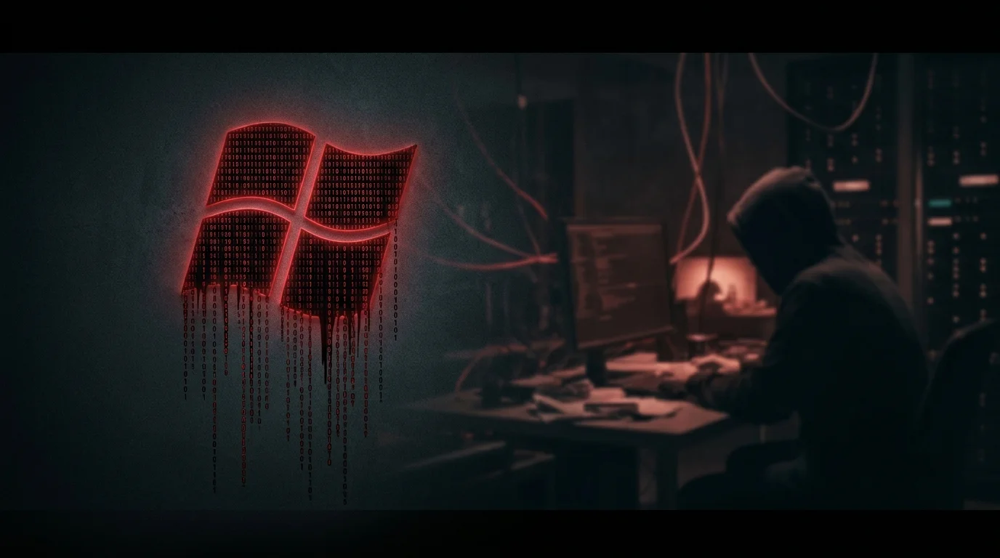
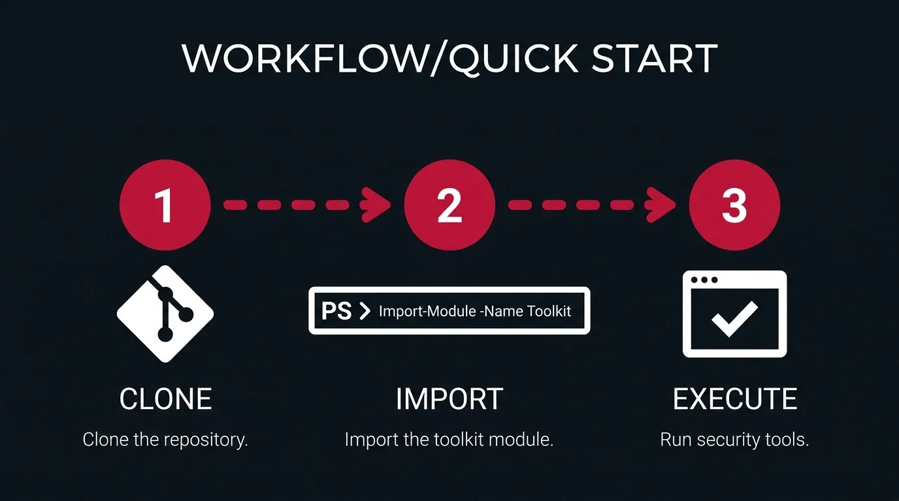
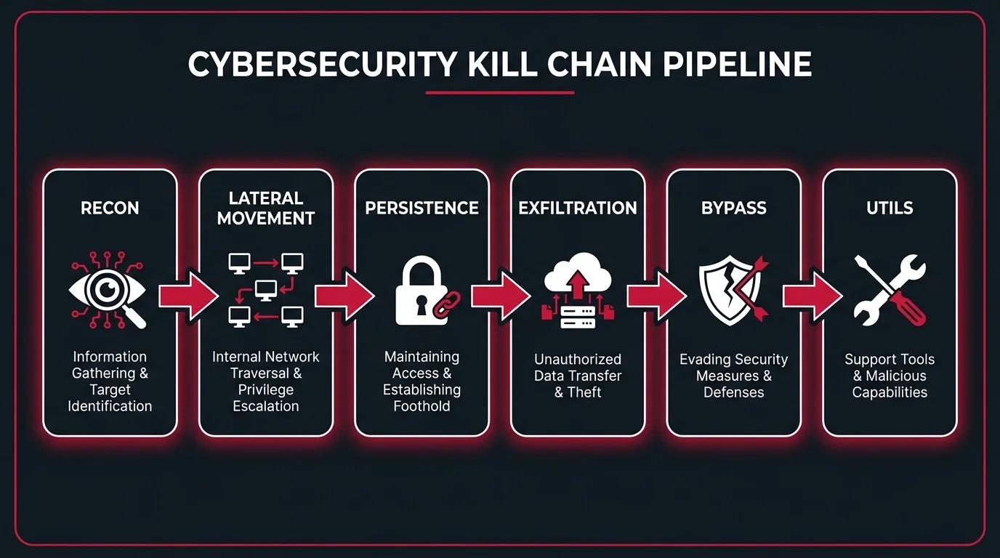
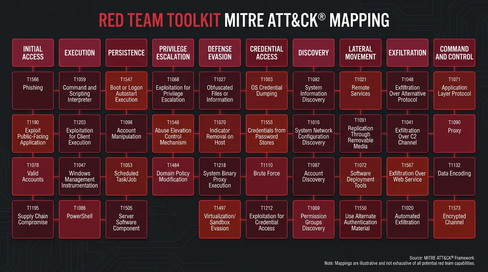
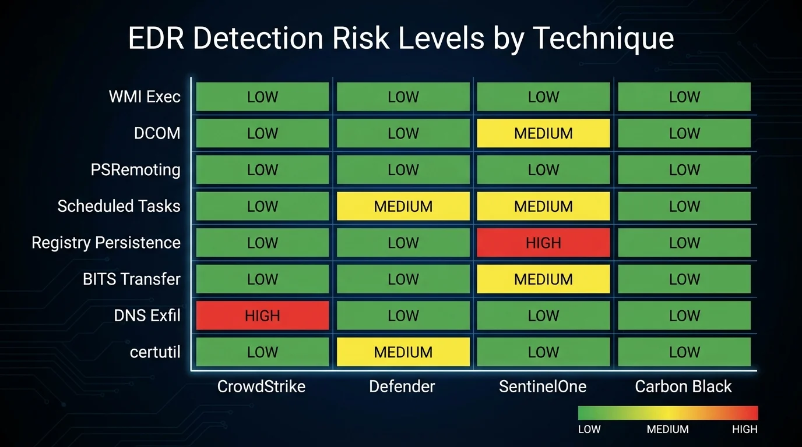
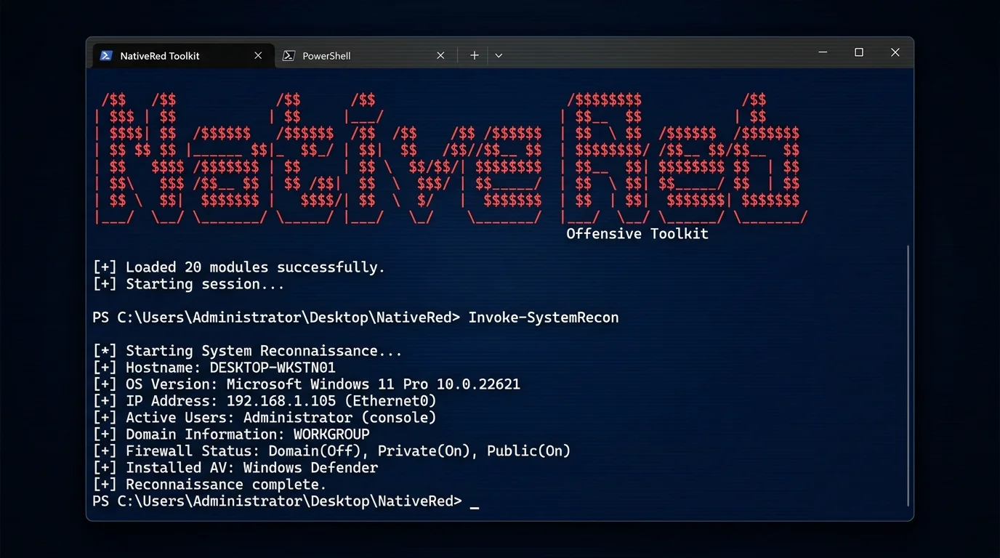

<div align="center">



# Native Windows Red Team Toolkit

**A comprehensive Living Off the Land (LOTL) toolkit for Windows post-exploitation**

*No external binaries. No custom malware. Just native Windows tools and PowerShell.*

[](https://github.com/anubhavg-icpl/native-windows-red)
[](https://github.com/anubhavg-icpl/native-windows-red)
[](LICENSE)
[](https://github.com/anubhavg-icpl/native-windows-red)

</div>

---

## Overview

NativeRed is a modular PowerShell toolkit designed for authorized red team engagements and security research. It leverages only built-in Windows tools and native APIs, following the **Living Off the Land** philosophy to minimize detection surface and avoid application whitelisting controls.

**6 operational modules** | **50+ functions** | **Zero external dependencies**

---

## Quick Start



```powershell
# Clone the repository
git clone https://github.com/anubhavg-icpl/native-windows-red.git
cd native-windows-red

# Import the full module
Import-Module .\NativeRed.ps1

# View all available commands
Get-Command -Module NativeRed

# Interactive help menu
Get-NativeRedHelp   # or: nrhelp
```

### Use Individual Scripts

```powershell
# Dot-source and run a specific module
. .\recon\Invoke-SystemRecon.ps1
Invoke-SystemRecon -Verbose -OutputPath C:\temp\recon.txt
```

### Use Without PowerShell

```cmd
:: Pure cmd.exe enumeration -- no PowerShell required
native-enum.bat > output.txt 2>&1
```

---

## Architecture



```
native-windows-red/
├── NativeRed.ps1                         # Main loader module
│
├── recon/                                # Reconnaissance and Enumeration
│   ├── Invoke-SystemRecon.ps1            #   Local system enumeration
│   ├── Invoke-ADEnum.ps1                 #   Active Directory enumeration (ADSI)
│   ├── Invoke-NetworkRecon.ps1           #   Network discovery and mapping
│   └── native-enum.bat                   #   Pure cmd.exe enumeration
│
├── lateral-movement/                     # Lateral Movement
│   ├── Invoke-WMIExec.ps1                #   Remote execution via WMI
│   ├── Invoke-PSRemoting.ps1             #   PowerShell Remoting wrapper
│   ├── Invoke-DCOMExec.ps1               #   Execution via DCOM objects
│   ├── Invoke-ScheduledTaskExec.ps1      #   Remote scheduled task execution
│   └── Invoke-ServiceExec.ps1            #   Service-based execution (SYSTEM)
│
├── persistence/                          # Persistence Mechanisms
│   ├── Invoke-RegistryPersistence.ps1    #   Registry Run key persistence
│   ├── Invoke-ScheduledTaskPersistence.ps1 # Scheduled task persistence
│   ├── Invoke-WMIEventPersistence.ps1    #   WMI event subscription persistence
│   └── Invoke-StartupPersistence.ps1     #   Startup folder persistence
│
├── exfiltration/                         # Data Exfiltration
│   ├── Invoke-HTTPExfil.ps1              #   HTTP/HTTPS data exfiltration
│   ├── Invoke-DNSExfil.ps1               #   DNS tunneling exfiltration
│   ├── Invoke-BITSExfil.ps1              #   BITS transfer exfiltration
│   └── Invoke-SMBExfil.ps1               #   SMB-based exfiltration
│
├── bypass/                               # Application Whitelisting Bypass
│   ├── Invoke-MSBuildBypass.ps1          #   Execute code via MSBuild inline C#
│   └── Invoke-MshtaBypass.ps1            #   Execute code via Mshta HTA/VBScript
│
├── payloads/                             # Ready-to-Use Payload Templates
│   ├── msbuild/reverse-shell.xml         #   MSBuild reverse shell payload
│   ├── hta/reverse-shell.hta             #   HTA reverse shell payload
│   └── sct/command-exec.sct              #   Scriptlet command execution payload
│
└── utils/                                # Utility Functions
    └── helpers.ps1                       #   Admin checks, EDR enumeration, crypto, logging
```

---

## Module Reference

### Reconnaissance

| Function | Description |
|----------|-------------|
| `Invoke-SystemRecon` | Comprehensive local system enumeration -- OS, users, processes, services, network configuration, installed software, security products, scheduled tasks, unquoted service paths |
| `Invoke-ADEnum` | Active Directory enumeration using ADSI -- domain info, DCs, trusts, Domain/Enterprise Admins, users, computers, SPNs (Kerberoastable), privileged accounts, password policy, OUs |
| `Invoke-NetworkRecon` | Network discovery -- interfaces, routing, ARP/DNS cache, listening/established ports, firewall status, shares, WiFi profiles, optional subnet ping sweep |
| `New-PortForward` | Create a `netsh` port forward for network pivoting |
| `Remove-AllPortForwards` | Remove all `netsh` port forwarding rules |
| `native-enum.bat` | Pure `cmd.exe` enumeration script with zero PowerShell dependency |

### Lateral Movement

| Function | Description |
|----------|-------------|
| `Invoke-WMIExec` | Execute commands on remote systems via `Win32_Process.Create`; retrieves output via admin share |
| `Invoke-WMIQuery` | Run arbitrary WMI queries against remote systems |
| `Get-RemoteProcesses` | List processes on a remote system via WMI |
| `Get-RemoteServices` | List services on a remote system via WMI |
| `Get-RemoteLoggedOnUsers` | Get currently logged-on users via WMI |
| `Invoke-PSRemoting` | Execute commands via WinRM -- interactive session, scriptblock, or file execution |
| `New-PersistentSession` | Create a reusable `PSSession` for multiple commands |
| `Copy-ToRemote` | Copy a file to a remote system via `PSSession` |
| `Copy-FromRemote` | Copy a file from a remote system via `PSSession` |
| `Invoke-ParallelCommand` | Execute a scriptblock on multiple targets with configurable throttling |
| `Invoke-DCOMExec` | Execute commands via DCOM -- `MMC20.Application`, `ShellWindows`, or `ShellBrowserWindow` |
| `Test-DCOMAccess` | Test which DCOM methods are available on a remote target |
| `Invoke-ExcelDCOM` | Execute commands via Excel DCOM (requires Excel on target) |
| `Invoke-ScheduledTaskExec` | Create, execute, and clean up a remote scheduled task via `schtasks.exe` |
| `Invoke-PowerShellScheduledTask` | Create a remote scheduled task using CIM sessions |
| `Get-RemoteScheduledTasks` | Query scheduled tasks on a remote system |
| `Invoke-ServiceExec` | Create a temporary Windows service for command execution (runs as SYSTEM) |
| `Set-ServiceBinaryPath` | Modify the binary path of an existing service for privilege escalation |
| `Find-VulnerableServices` | Detect services with unquoted paths or writable binaries |

### Persistence

| Function | Description |
|----------|-------------|
| `Invoke-RegistryPersistence` | Create Run/RunOnce registry entries (`HKCU` or `HKLM`), or append to `Winlogon\Userinit` |
| `Get-RegistryPersistence` | Enumerate all persistence entries in common registry locations |
| `New-HiddenRegistryKey` | Create a null-byte prefixed registry key invisible to standard registry tools |
| `Invoke-ScheduledTaskPersistence` | Create a scheduled task with configurable triggers -- logon, startup, daily, hourly, idle |
| `Get-SuspiciousScheduledTasks` | Find scheduled tasks matching suspicious patterns (script engines, encoded commands, network refs) |
| `Invoke-WMIEventPersistence` | Create a WMI event subscription (filter + consumer + binding) for stealthy persistence |
| `Get-WMIEventSubscriptions` | Enumerate all WMI event subscriptions on the system |
| `Remove-AllWMIPersistence` | Bulk remove all WMI event subscriptions |
| `Invoke-StartupPersistence` | Drop a `.lnk`, `.bat`, or `.vbs` file in the Startup folder (current user or all users) |
| `Get-StartupItems` | Enumerate all items in user and all-users Startup folders |

### Exfiltration

| Function | Description |
|----------|-------------|
| `Invoke-HTTPExfil` | Upload files or data via HTTP/HTTPS POST with automatic chunked upload for large files |
| `Invoke-WebClientExfil` | Upload a file using `System.Net.WebClient` |
| `Start-SimpleHTTPServer` | Start a local HTTP listener for receiving exfiltrated data (testing) |
| `Invoke-DNSExfil` | Exfiltrate data encoded in DNS subdomain queries -- stealthy and firewall-friendly |
| `New-DNSExfilServer` | Print setup instructions and Python receiver code for DNS exfiltration |
| `Invoke-BITSExfil` | Upload or download files via BITS -- resumable, low-priority, resembles Windows Update traffic |
| `Get-BITSJobs` | List all BITS transfer jobs |
| `Remove-BITSJob` | Cancel and remove a BITS job |
| `Invoke-SMBExfil` | Copy files to a remote SMB share with optional credential-based drive mapping |
| `Get-RemoteShares` | Enumerate SMB shares on a remote system |
| `Test-ShareAccess` | Test read and write access to a network share |
| `Invoke-CertutilExfil` | Download/upload files using `certutil.exe` (high detection risk -- use as last resort) |

### Bypass

| Function | Description |
|----------|-------------|
| `Invoke-MSBuildBypass` | Execute PowerShell or cmd commands via MSBuild inline C# task -- bypasses AppLocker and WDAC |
| `New-MSBuildPayload` | Generate an MSBuild XML project file with embedded C# code |
| `New-MSBuildReverseShell` | Generate a full interactive TCP reverse shell as an MSBuild XML payload |
| `Invoke-MshtaBypass` | Execute commands via `mshta.exe` using HTA files, inline VBScript, or remote URL |
| `New-HTAPayload` | Generate an HTA file with VBScript payload execution |
| `New-HTAReverseShell` | Generate an HTA reverse shell payload |
| `New-SCTPayload` | Generate a `.sct` scriptlet for execution via `regsvr32.exe /s /n /u /i:` |

### Utilities

| Function | Description |
|----------|-------------|
| `Test-AdminPrivileges` | Check if the current process is running with administrative privileges |
| `Get-SecurityProducts` | Enumerate installed AV, EDR, and security products via WMI, process, and service detection |
| `Convert-ToBase64` | Encode a string or file to Base64 |
| `Convert-FromBase64` | Decode a Base64 string |
| `Get-RandomString` | Generate a random alphanumeric string for obfuscation |
| `New-EncryptedPayload` | XOR-encrypt a payload string with a key, output as Base64 |
| `Invoke-EncryptedPayload` | Decrypt and execute a XOR-encrypted Base64 payload |
| `Get-DomainInfo` | Get basic domain information for the current system |
| `Write-Log` | Write a timestamped, color-coded log entry (Info / Warning / Error / Success) |
| `ConvertTo-HexString` | Convert a byte array to a hex string |
| `ConvertFrom-HexString` | Convert a hex string to a byte array |

---

## MITRE ATT&CK Mapping



| Tactic | Techniques | Module |
|--------|-----------|--------|
| **Discovery** | T1082 System Info, T1087 Account Discovery, T1018 Remote System Discovery, T1046 Network Service Discovery, T1016 System Network Configuration | `recon/` |
| **Execution** | T1059.001 PowerShell, T1047 WMI, T1559.001 COM, T1053.005 Scheduled Task, T1569.002 Service Execution | `lateral-movement/`, `bypass/` |
| **Persistence** | T1547.001 Registry Run Keys, T1053.005 Scheduled Tasks, T1546.003 WMI Event Subscription, T1547.001 Startup Folder | `persistence/` |
| **Lateral Movement** | T1047 WMI, T1021.006 PowerShell Remoting, T1559.001 DCOM, T1053.005 Scheduled Tasks, T1569.002 Services | `lateral-movement/` |
| **Exfiltration** | T1041 Exfiltration Over C2 Channel (HTTP), T1048.001 Exfiltration Over Symmetric Encrypted Protocol (DNS), T1567 BITS, T1048 Exfiltration Over Alternative Protocol (SMB) | `exfiltration/` |
| **Defense Evasion** | T1127.001 MSBuild, T1218.005 Mshta, T1218.010 Regsvr32 | `bypass/` |

---

## Detection Considerations



### High Risk

Heavily monitored by modern EDR solutions:

- WMI remote execution and event subscription creation
- DCOM instantiation from remote hosts
- Windows service creation and binary path modification
- `certutil.exe` downloads and URL caching
- Registry `Run` key and `Userinit` modifications
- `mshta.exe` executing inline scripts

### Moderate Risk

Logged or partially detected:

- PowerShell Remoting (subject to ScriptBlock logging and AMSI)
- Scheduled task creation via `schtasks.exe`
- BITS transfer jobs to unusual destinations
- DNS query volume anomalies
- `MSBuild.exe` executing non-standard project files

### Lower Risk

Blends with legitimate administrative activity:

- Native `cmd.exe` enumeration (`native-enum.bat`)
- Standard PowerShell information gathering (non-encoded)
- File copy operations via SMB
- `netsh` port forwarding (common in administration)

### Operational Recommendations

1. Layer bypass techniques with AMSI circumvention before executing modules
2. Avoid `-EncodedCommand` and `-enc` flags when possible
3. Time operations to match legitimate admin activity patterns
4. Prefer WMI queries over `net.exe` commands for enumeration
5. Reuse established sessions instead of repeated authentication cycles
6. Use `native-enum.bat` as a fallback when PowerShell is restricted or monitored

---

## Terminal Preview



```powershell
PS D:\native-windows-red> Import-Module .\NativeRed.ps1

    _   _       _   _           ____          _
   | \ | | __ _| |_(_)_   _____|  _ \ ___  __| |
   |  \| |/ _` | __| \ \ / / _ \ |_) / _ \/ _` |
   | |\  | (_| | |_| |\ V /  __/  _ <  __/ (_| |
   |_|\_|\__,_|\__|_| \_/ \___|_| \_\___|\__,_|

   Windows Living Off the Land Toolkit v1.0.0

[+] Loaded 20 modules successfully

PS D:\native-windows-red> Invoke-SystemRecon -Brief

============================================================
  SYSTEM INFORMATION
============================================================
  ComputerName: DESKTOP-REDTEAM
  OSName: Microsoft Windows 11 Pro
  Architecture: 64-bit
  TotalMemoryGB: 32.00
  IsAdmin: True
  Domain: CORP.LOCAL

PS D:\native-windows-red> Invoke-NetworkRecon -ScanSubnet
[*] Scanning 192.168.1.0/24...
[+] 192.168.1.1    (router.corp.local)
[+] 192.168.1.10   (DC01.corp.local)
[+] 192.168.1.50   (FILESERVER.corp.local)
```

---

## Testing Environments

This toolkit is designed for use in authorized testing environments:

- Home lab environments and virtual machines
- Systems without EDR (legacy Windows 7 / Server 2008)
- CTF competitions and security training platforms
- Authorized penetration testing and red team engagements
- Security research environments with proper isolation

---

## References

- [LOLBAS Project](https://lolbas-project.github.io/) -- Living Off The Land Binaries and Scripts
- [MITRE ATT&CK](https://attack.mitre.org/) -- Adversarial Tactics, Techniques, and Common Knowledge
- [Microsoft Documentation](https://docs.microsoft.com/) -- Official Windows and PowerShell documentation
- [SANS Penetration Testing](https://www.sans.org/offensive-security/) -- Offensive security resources

---

## Contributing

Contributions are welcome. Please follow these steps:

1. Fork the repository
2. Create a feature branch (`git checkout -b feature/my-feature`)
3. Commit your changes (`git commit -m 'Add my feature'`)
4. Push to the branch (`git push origin feature/my-feature`)
5. Open a Pull Request with a detailed description

---

## License

This project is licensed under the MIT License. See [LICENSE](LICENSE) for details.

---

## Legal Disclaimer

**This toolkit is intended for authorized security testing, red team engagements, penetration testing, and educational purposes only.** Unauthorized access to computer systems is illegal. Always obtain proper written authorization before testing any systems you do not own. The author assumes no liability for misuse of this toolkit. By using these tools, you agree to use them responsibly and ethically.

---

<div align="center">

**Built by [Anubhav Gain](https://github.com/anubhavg-icpl)**

[](https://github.com/anubhavg-icpl)

</div>
